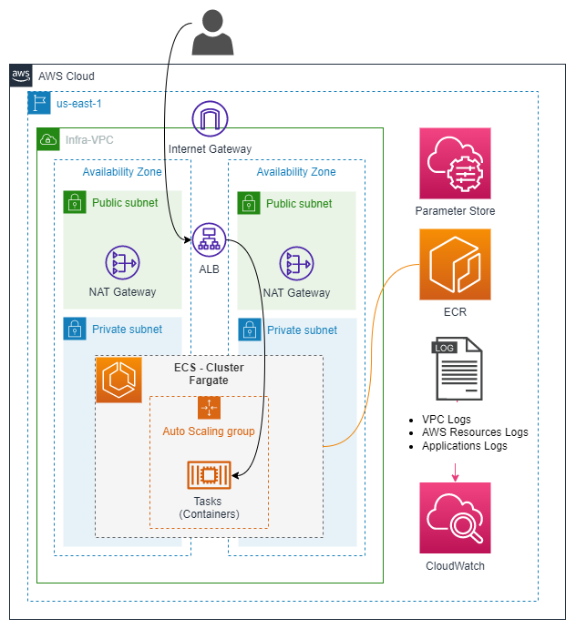
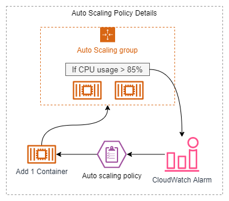

# Serverless ECS Clusters deployment.

This terraform project deploy a production ready ECS Cluster using fargate instances. As an example I'm using a simple python-flask application of which you can learn more in [this link](https://github.com/JManzur/flask-demo).

At the end of the deployment, you will have:
- **Full VPC** with segmented subnets, nat gateway, internet gateway, basic routing tables and an initial security group.
- **Elastic Container Registry (ECR)** with Lifecycle Policy.
- **Automated and reusable way to build, tag and push a Docker image**.
- **Application Load Balancer (ALB)** ready to route any request to the fargate instances, even when they are scale up or down.
- **Security Groups** one to allow access from the outside world to the ALB, and other to provide secure access from the ALB to the ECS cluster private subnet.
- **Auto Scaling configuration** based on an cloudwatch trigger that monitor the container cpu utilization. 
- **IAM Role** capable of running ECS task, get parameter from the system manager parameter store, and allow the use of "ecs execute-command" to be able to access any docker container running inside a fargate instance. (ssh-like access). 
    - **NOTE**: To achieve that, the flag "enable_execute_command" MUST be set to "true" in the ecs service definition.
- Working **Elastic Container Service (ECS)** cluster with the flask-demo app deployed and accessible via the ALB DNS. Which will be conveniently output at the end of the deployment using the "flask-alb-dns" value form the output.tf file.
- And of course you will have **everything properly (and beautifully) tagged** :wink: .

## High level diagram:





## Tested with: 

| Environment | Application | Version  |
| ----------------- |-----------|---------|
| WSL2 Ubuntu 20.04 | Terraform | v1.2.2  |
| WSL2 Ubuntu 20.04 | aws-cli | v2.5.3 |
| WSL2 Ubuntu 20.04 | session-manager-plugin | 1.2.205.0 |
| Windows 10 V21H1 | Docker Desktop | 3.5.1 |
| WSL2 Ubuntu 20.04 | Docker (WSL Backend) | 20.10.16  |
| WSL2 Ubuntu 20.04 | Python | 3.8.10 |

## Initialization How-To:

Located in the root directory, make an "aws configure" to log into the aws account, and a "terraform init" to download the necessary modules and start the backend. 

```bash
aws configure
terraform init
```

## Deployment How-To:

Located in the root directory run the manifests:

```bash
terraform apply
```

## Debugging / Troubleshooting:

#### **Debugging Tip #1**: Accessing the fargate container
 - The IAM policy, task definition and ecs services are ready to allow the use of "aws ecs execute-command", so if you want to access a fargate container you can do it using aws-cli as follows:

```bash
#Format:
aws ecs execute-command --cluster {CLUSTER_NAME} --task {TASK_ID} --container {CONTAINER_NAME} --command "/bin/bash" --interactive --region {REGION} --profile {PROFILE}

#Example:
aws ecs execute-command --cluster demo-cluster --task 18f1e118-07d1-44f2-ad61-37d35d70e145 --container demo_flask_app --command "/bin/bash" --interactive --region us-east-1 --profile SomeProfile
```

> :information_source: For ease of use I wrote two bash scripts which you can learn more about [here](https://github.com/JManzur/ecs-deploy/tree/main/scripts).

#### **Debugging Tip #2**: Testing the Auto Scaling configuration
- **Scale UP**: If the overall CPU utilization of the ECS Service go over 85% for more that 2 minutes (2 consecutive periods of 60 seconds), the auto scaling policy will deploy 1 more container and will continue doing so until it reaches the configured maximum of 6 containers. 
- **Scale Down**: When the overall CPU utilization of the ECS Service go under 20% for more that 2 minutes (2 consecutive periods of 60 seconds), the auto scaling policy will take down 1 container and will continue doing so until it reaches the configured minimum of 3 containers.
- **Testing**: If you wish to test the policy, you could access the containers using the method explained in the "Debugging Tip #1"  and then run a CPU stress test like so:

```bash
stress -c 1
```

#### **Known issue #1**: Error during docker built
 - **Issue**: During the docker build you receive the following error:

```bash
ERROR: failed to authorize: rpc error: code = Unknown desc = failed to fetch oauth token: │ unexpected status: 400 Bad Request
```

- **Cause**: Temporary communication problem with docker hub.

- **Solution**: Re-run the docker build command (or terrafrom manifest).


## Documentation

- [Dockerfile github repository](https://github.com/JManzur/flask-demo)
- [VPC Manifest github repository](https://github.com/JManzur/demo-vpc)
- [Session Manager plugin](https://docs.aws.amazon.com/systems-manager/latest/userguide/session-manager-working-with-install-plugin.html)
