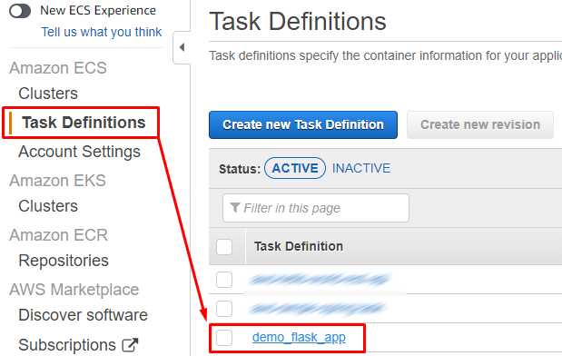
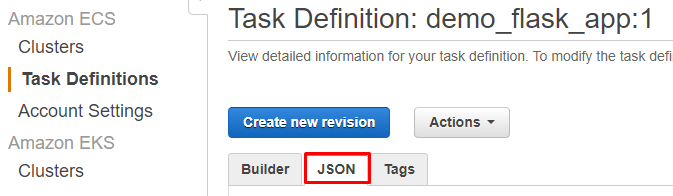
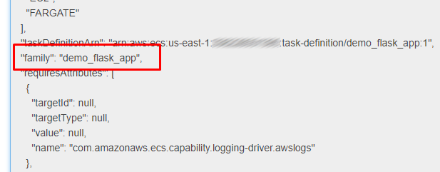

# ECS Exec - Connection Scripts

This folder contains two bash scripts that can be used to connect to a ECS Fargate Task.  

> :information_source: The flask application provided in this demo is already prepared to allow SSM connections, for more information about this solution you can refer to [this link](https://docs.aws.amazon.com/AmazonECS/latest/userguide/ecs-exec.html)

## Features:

- connect_to_task_prompt.sh
    - Validates if the required commands are installed.
    - Validates if the required aws cli version is installed.
    - **Interactive prompt to start a SSM session in the ECS task.**
    - Generates a list of task IDs available to connect to. 
    - Progress bar decorator.
    - Works with or without aws profiles.
- connect_to_task_json_file.sh
    - Validates if the required commands are installed.
    - Validates if the required aws cli version is installed.
    - **Read the required variables from a json file** (Sample file included).
        - Variables:
            - AWS_REGION
            - AWS_PROFILE
            - ECS_CLUSTER
            - CONTAINER_FAMILY
            - CONTAINER_NAME
    - Generates a list of task IDs available to connect to. 
    - Progress bar decorator.
    - Works with or without aws profiles.

## How to get the "Container Family Name"

The "Container Family Name" is the key to the lookup function, so you need to specify this value in both scripts, if you don't know that value, here's how you can find it:

Go to your ECS Cluster, select "Task Definitions" and then select the task definition:

Navigate to the json view of the task definition:

Do a search for the key "family", and the value of that key is the family name of your container:

## Tested with: 

| Environment | Application | Version  |
| ----------------- |-----------|---------|
| WSL2 Ubuntu 20.04 | bash | v5.0.17 |
| WSL2 Ubuntu 20.04 | aws cli | v2.7.9  |
| WSL2 Ubuntu 20.04 | session-manager-plugin | v1.2.205.0  |
| WSL2 Ubuntu 20.04 | jq | v1.6 |

## Author:

- [@JManzur](https://jmanzur.com)

## Documentation:
- [Configuring the AWS CLI](https://docs.aws.amazon.com/cli/latest/userguide/cli-chap-configure.html)
- [Using Amazon ECS Exec for debugging
](https://docs.aws.amazon.com/AmazonECS/latest/userguide/ecs-exec.html)